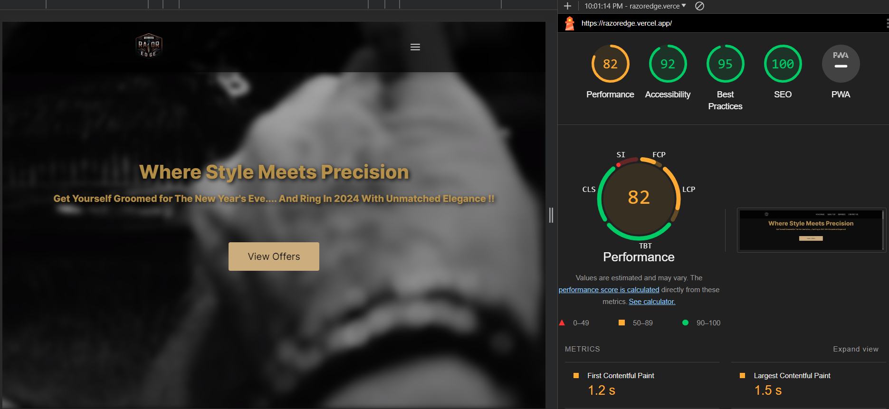
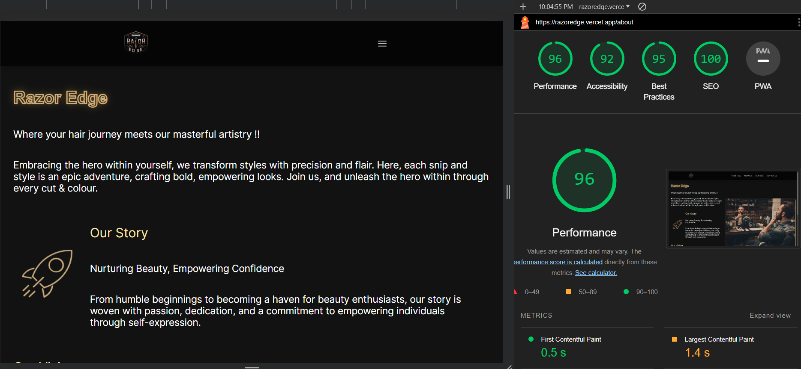

# Lighthouse and SEO Analysis Guide for Razor Edge Website

This guide outlines the process for generating Lighthouse reports and checking the SEO of the Razor Edge website.

## Lighthouse Report Generation

Lighthouse is an open-source, automated tool for improving the quality of web pages. It can audit performance, accessibility, and more.

### Steps:

1. **Install Lighthouse**:
   - If you have Node.js installed, run `npm install -g lighthouse`.
   - Alternatively, use Google Chrome's built-in Lighthouse.

2. **Run Lighthouse**:
   - Command Line: `lighthouse https://razoredge.vercel.app/ --view`.
   - Chrome DevTools: Go to the Audits panel, and click 'Generate report'.

## SEO Analysis

SEO (Search Engine Optimization) is crucial for ensuring your website is easily discoverable.

### Steps:

1. **Install SEO Analysis Tool**:
   - You can use tools like Screaming Frog SEO Spider or Google Search Console.

2. **Run Analysis**:
   - Follow the instructions provided by the specific tool to analyze your website's SEO performance.

## Additional Resources

- [Lighthouse Documentation](https://developers.google.com/web/tools/lighthouse)
- [Google Search Console](https://search.google.com/search-console/about)

### Final Report

---

**Note**: Regularly updating and auditing website's performance and SEO is key to maintaining a strong online presence.
