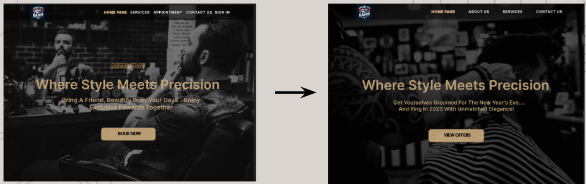
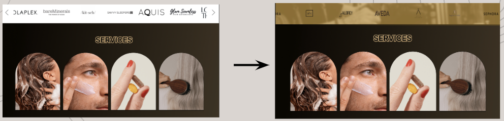
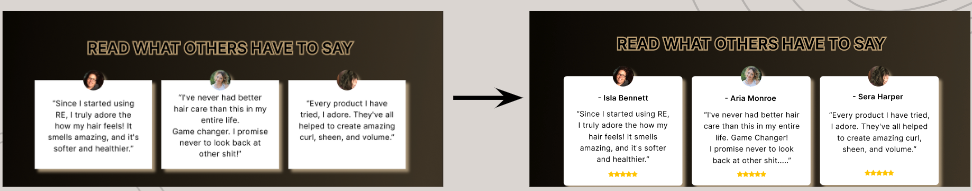
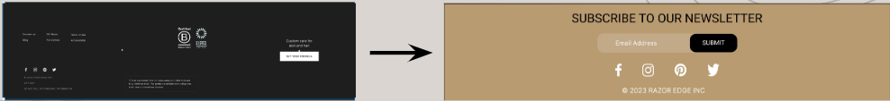
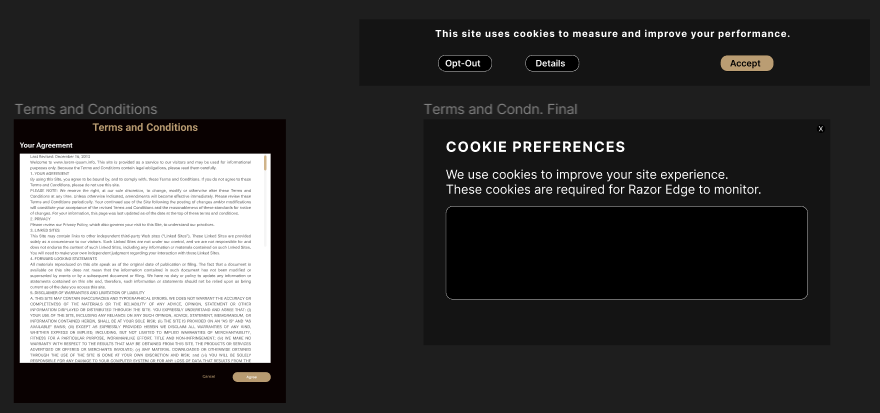
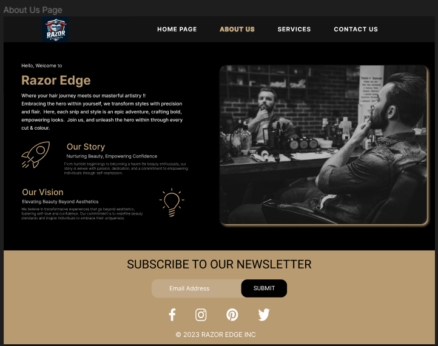
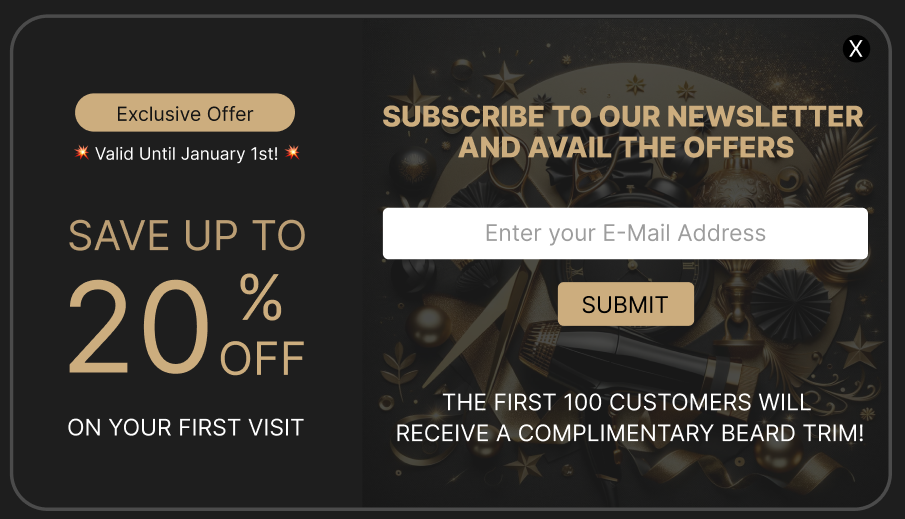

# Website Redesign Usability Testing Report

This report consolidates the usability testing results for various components of our website redesign. Each section provides a detailed analysis of the changes, objectives, methodologies, findings, and recommendations for the respective website components.

---

## Hero Section Update

### Summary of Changes
- Updated headline and subtext to align with current promotions.
- Modified call-to-action (CTA) button from "BOOK NOW" to "VIEW OFFERS".

### Findings
- Increased engagement with the updated CTA.
- Improved user interaction with the hero section.

### Recommendations
- Continue monitoring engagement metrics.
- Consider adding user testimonials to enhance credibility.

---

## Carousel and Services Section Enhancement

### Summary of Changes
- Transitioned to an auto-scrolling carousel.
- Implemented horizontal scrolling for brand displays.

### Findings
- Enhanced user efficiency in brand interaction.
- Positive feedback on the auto-scroll feature.

### Recommendations
- Add a pause function to the auto-scroll feature.
- Regularly update carousel content to maintain user interest.

---

## Testimonials Section Refinement

### Summary of Changes
- Included names and ratings for each testimonial.

### Findings
- Higher trust level expressed by users.
- Increased time spent on the testimonials section.

### Recommendations
- Add submission dates to testimonials.
- Regularly refresh testimonials to reflect current customer experiences.

---

## Footer Section Redesign

### Summary of Changes
- Updated the design to match the website's theme.
- Enhanced the newsletter subscription box.

### Findings
- Improved visual appeal and increased newsletter sign-ups.

### Recommendations
- Make brand information more prominent for new users.
- Ensure all social media icons are current and functional.

---

## Cookie Consent and Privacy Policy Design Update

### Summary of Changes
- Redesigned cookie consent banner for clarity.
- Reformatted privacy policy for better readability.

### Findings
- Users made more informed choices regarding cookie consent.
- Improved comprehension of the privacy policy.

### Recommendations
- Clarify the language used in the cookie consent banner.
- Introduce an interactive FAQ section for the privacy policy.

---

## New 'About Us' Page Development

### Summary of Changes
- Created a new 'About Us' page to replace the appointments page.
- Incorporated brand storytelling and a newsletter subscription feature.

### Recommendations
- Proofread all copy for accuracy and brand alignment.
- Test the page for accessibility compliance.

---

## Promotional Offer Banner Implementation

### Summary of Changes
- Implemented a new promotional offer banner triggered by the 'View Offers' button.

### Findings
- The banner successfully created a sense of urgency and increased newsletter subscriptions.

### Recommendations
- Validate email addresses entered in the subscription form.
- Set up event tracking for analytics purposes.

---

## Conclusion

The website redesign has shown positive usability improvements across various sections. Continued monitoring and iterative enhancements based on user feedback will be vital to maintaining a high-quality user experience.